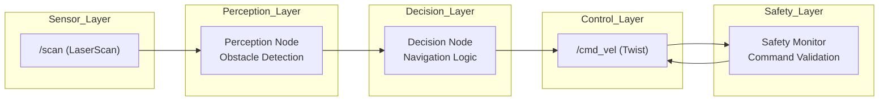

# Autonomous Navigation Simulation (ROS2 C++)

## Overview

This project implements a modular ROS2-based autonomy pipeline that processes simulated LiDAR data into real-time navigation decisions and control commands.

The system follows a layered architecture:

**Sensor → Perception → Decision → Control → Safety**

It simulates key components of real-world robotics systems, including obstacle detection, navigation logic, and velocity command generation, and is designed to be easily extended to real LiDAR hardware or simulation environments such as Gazebo.

### System Overview

This system simulates an autonomous navigation pipeline using ROS2:

- **Sensor Layer**: Simulated LiDAR (`/scan`)
- **Perception**: Detects obstacles from scan data
- **Decision**: Determines navigation behavior
- **Control**: Publishes velocity commands (`/cmd_vel`)
- **Safety Monitor**: Overrides commands if hazards are detected

---

## Architecture Diagram



---

## Nodes

### fake_scan_node

* Publishes simulated `LaserScan` data to `/scan`
* Generates dynamic obstacle scenarios

### perception_node

* Processes `/scan`
* Computes sector-based obstacle distances (left, center, right)
* Outputs `/perception_state`

### decision_node

* Consumes `/perception_state`
* Produces navigation decisions
* Publishes:

  * `/navigation_decision`
  * `/cmd_vel` (Twist control commands)

### safety_monitor_node

* Monitors perception and decision outputs
* Validates navigation commands before execution
* Acts as a safety layer to prevent unsafe motion decisions

---

## Data Flow

```
/scan (LaserScan)
   ↓
perception_node
   ↓
/perception_state (String)
   ↓
decision_node
   ↓
/navigation_decision (String)
/cmd_vel (Twist)
```

---

## Features

* Modular ROS2 multi-node architecture
* Real-time LiDAR-style perception processing
* Directional obstacle awareness (left / center / right)
* Rule-based decision-making
* Control output using `/cmd_vel`
* Dynamic scenario simulation
* RViz visualization support

---

## RViz Visualization

The system visualizes LiDAR data in RViz:

* Topic: `/scan`
* Frame: `laser_frame`
* Displays dynamic obstacle scenarios in real-time

---

## How to Run

### Build

```bash
colcon build --packages-select autonomous_navigation_sim
source install/setup.bash
```

### Launch

```bash
ros2 launch autonomous_navigation_sim sim_launch.py
```

This launches:

* All ROS2 nodes
* RViz with preconfigured visualization

---

## Example Scenarios

* Clear path
* Center obstacle
* Left/right obstacle
* Fully blocked
* Narrow corridor
* Asymmetric obstacle distributions

---

## Technologies

* ROS2 (rclcpp)
* C++
* sensor_msgs / geometry_msgs
* RViz

---

## Demo

This system demonstrates real-time LiDAR processing, decision-making, and control output.

In RViz, the scan dynamically updates as obstacle scenarios change, while the system generates navigation commands accordingly.

---

## Future Improvements

* Replace simulated scan with real LiDAR input
* Integrate with Gazebo or TurtleBot
* Introduce probabilistic or ML-based perception
* Add path planning layer

---

## Author

John Cartagena
